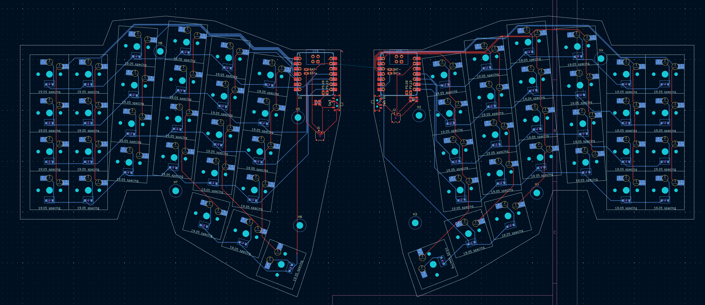

# Pocketable: A smol, pocketable, very pretty keyboard.

if a corne and a zsa voyager had a child

# more photos :3

le pcb

le case

# why is this special?

This photo is why:

This is a cutting board. Notably, it's a handmade wooden cutting board with 3 different types of wood in it. This is what I'm going to be making this keyboard into, as I have access to a professional woodshop and enough types of CNC to make something like this.

This will actually be for sale once I have a decent methodology for making the case multiple times, as I've already had multiple people reach out.

I would put a decent looking render in but my blender instance just...doesn't open anymore? So I can't get renders functioning sadly.

# BOM

[the gooble sheet](https://docs.google.com/spreadsheets/d/1JvyBpCuiH7XgFo-gO215HGFeqtSEhnPSUs8fcJy509Q/edit?gid=363512385#gid=363512385)

| ITEM                  | SUPPLIER        | COUNT | UNIT COST | ROW COST |
| --------------------- | --------------- | ----: | --------: | -------: |
| Xiao ESP32            | typeractive.xyz |     2 |    $16.99 |   $33.98 |
| Kailh Hotswap Sockets | typeractive.xyz |    60 |     $0.15 |    $9.00 |
| Battery Jack          | typeractive.xyz |     2 |     $0.50 |    $1.00 |
| 1.5u Keycap           | typeractive.xyz |     0 |     $0.50 |    $0.00 |
| Homing Keycap         | typeractive.xyz |     0 |     $0.50 |    $0.00 |
| Keycap                | typeractive.xyz |     0 |     $0.40 |    $0.00 |
| Choc Switches         | typeractive.xyz |    60 |     $0.55 |   $33.00 |
| Diodes                | typeractive.xyz |    60 |     $0.08 |    $4.80 |
| Power Switch          | typeractive.xyz |     2 |     $0.75 |    $1.50 |
| Wood                  | Local           |     1 |    $30.00 |   $30.00 |
