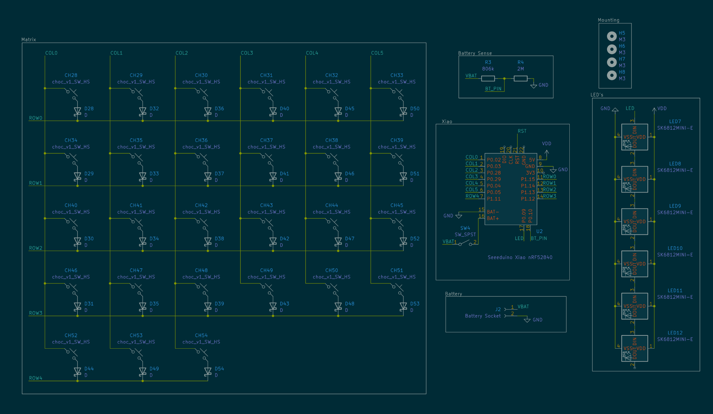

# Pocketable

ignore the fact that some of the keycaps are shiny and others are matte. blender is not happy with me.

if a corne and a zsa voyager had a child\_

This project was made for one primary reason: my old split keyboard design kinda sucked to make layouts for. The thumb cluster was horrible. This, however, will function with ZSA Voyager layouts, which are generally shared publicly and well-tested.

This will be for sale eventually. Please reply to [issue 1](https://github.com/lordbagel42/pocketable/issues/1) if you would like to buy one. Cost will be around $240 per keyboard.

## but why?

This keyboards a little special compared to most, for one reason: it's almost all made in-house by me. I'll be machining the brass plate myself along with the wooden base case, plus laser-cutting the acrylic LED cover myself. It's also all hand soldered and one day will have custom keycaps. For now though I've been graciously sponsored with black keycaps.

# BOM

View the BOM at [this google sheet](https://docs.google.com/spreadsheets/d/1JvyBpCuiH7XgFo-gO215HGFeqtSEhnPSUs8fcJy509Q/edit?gid=363512385#gid=363512385). Total cost at time of writing this README is ~$250

## more photos :3

heres the pcb design!

silkscreen art will be included for mine, however I won't be showing it in this repo as it contains a lil PII :3

## left half schematic

## right half schematic

